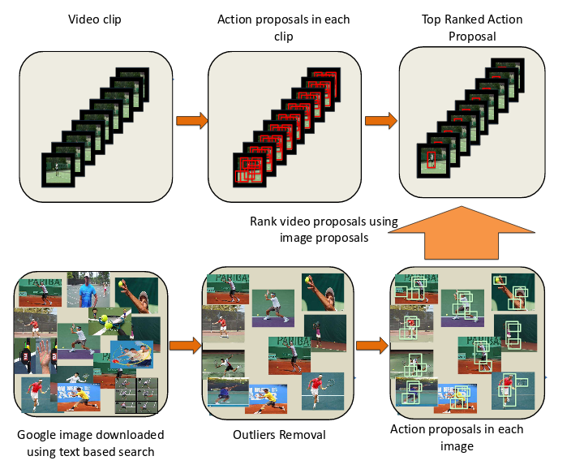
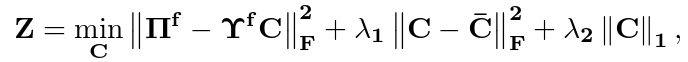

## [What if we do not have multiple videos of the same action? —Video Action Localization Using Web Images](www.cv-foundation.org/openaccess/content_cvpr_2016/papers/Sultani_What_If_We_CVPR_2016_paper.pdf)

TL;DR

文章是使用text based searched web images去改善action proposals.

### Details

* 使用random walk去除一些outliers.
* 在image上进行action proposals, 为了找到proposals with common concept, 然后对proposals in all the images进行匹配，使用的是`Probabilistic Hough Matching`.
然后每一个proposal的score由其standout score和matched score决定。其matched score是选取的所有匹配中最大的那个score.
* action proposals in vidoe. 方法是merge supervoxel using randomized Prim’s maximum span tree algorithm. 然后使用optical flow gratitude作为标准给每一个proposal一个motion score, 最后做nms去除重复的proposals. 然后每个视频保留最多50个proposals.
* 最后一步是使用image-based proposals去指导rank video-based proposals. 主要是利用了重构的思想，认为video porposals可以使用所有image proposals去重构出来。

