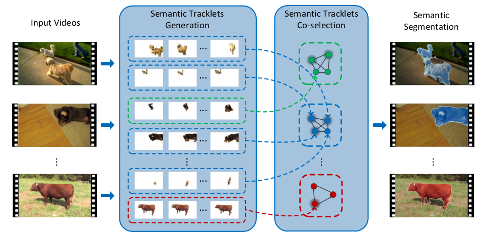
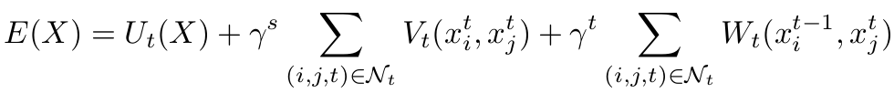
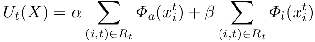
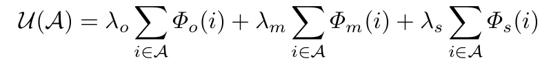
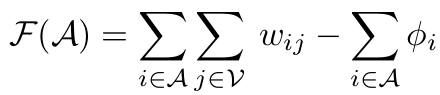

##[Semantic Co-segmentation in Videos](https://dl.dropboxusercontent.com/u/73240677/ECCV16/eccv16_cosegmentation.pdf)

* 带语义的co-segmentation,　本文使用graph-cut方法优化。

### generate semantic tracklet

* 输入是物体类别未知的一系列视频，目的是得到发现并分割到视频中的主要物体，并对物体类别做出标注。
* 文章使用FCN对所有视频中的图像产生proposal, 并给每个proposal做一个lable。
* 具有相同lable的图像做聚类，在每个类中随机选取(每隔约20图) initial图像，进一步使用tracking的方法，向前和向后分别跟踪形成tracklet.
* tracking 的方法：

其中，unary项约束appearance和location, appearance包含利用color histogram所训练出来的svm，以及cnn特征。

### Semantic Tracklet Co-selection via Submodular Function

* 这是一个基于[submodular function](https://en.wikipedia.org/wiki/Submodular_set_function)的方法。定义所有的tracklet作为node，依次取出Ｖ中的tracklet放入子集Ａ, 令顺次进入Ａ中的tracklet使得能量函数最大。
* 建立能量函数，并优化.

* unary 项分别是tracklet中objectness, motion consistency, 和 shape consistency 的平均得分。
* pairwise项第一项是相似度度量，第二项是　φ is the cost to open a facility fixed to a constant.　并不知道是什么意思，也没有解释...

* 根据优化过程中的能量增量对Ａ中的tracklet进行重排序。能量增量高且不低于threshold的tracklet被保留。
