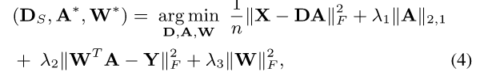
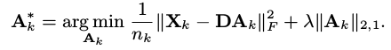

##[Fast Temporal Activity Proposals for Efficient Detection of Human Actions in Untrimmed Videos](http://www.cv-foundation.org/openaccess/content_cvpr_2016/papers/Heilbron_Fast_Temporal_Activity_CVPR_2016_paper.pdf)

TL;DR

文章的目的是在时间比较长的视频中检索到有意义的短时运动视频。

###Details

* 本文算法包含两个部分：１训练一个词典dictionary. 2 利用词典检索是否是词典中已经定义的action.
* 训练过程使用trimmed instance,　利用公式４求解。其中Ｄ是求得的Dictionary, w是action class的系数矩阵.Ａ是特征到Dictionary的系数矩阵。

* 检索时，计算最优的Ａ，并根据重建误差进行排序。误差越小，属于有意义视频段的概率越大。

* 文章中选取action proposal所用的是uniformly sampling over time.

* 文章在训练过程中做了两次训练：一次不使用class信息，一次使用class信息。　结果表明包含class信息的Dictionary更好用。
