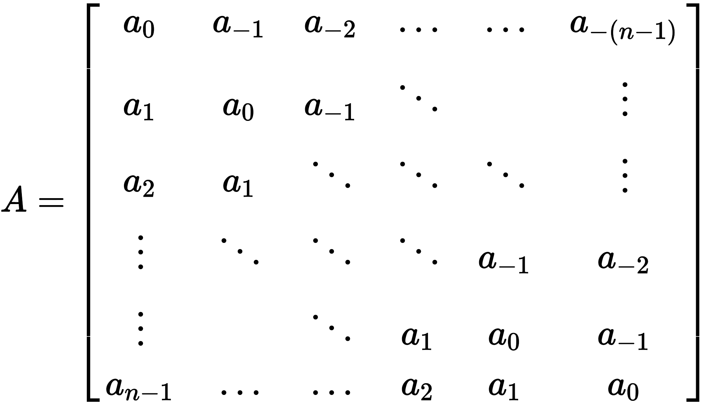
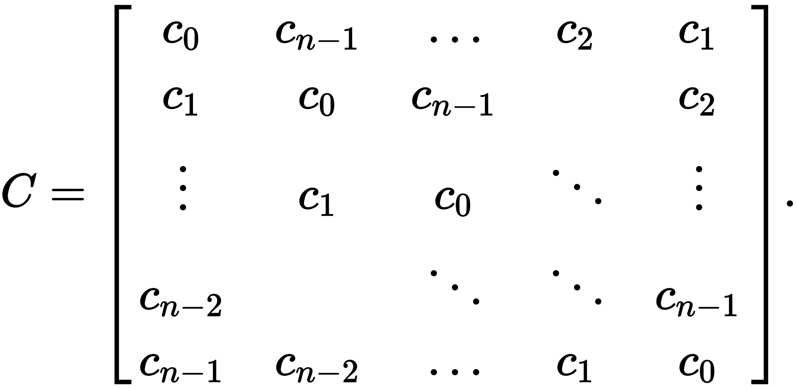

## [High-Speed Tracking with Kernelized Correlation Filters]()

### circulant matrix

* Toeplitz matrix

每个对角线都是常量

* circulant matrix

是一个特殊的Toeplitz matrix, 其每一行都是前一行向右旋转一个元素得到的。

### Motivation

