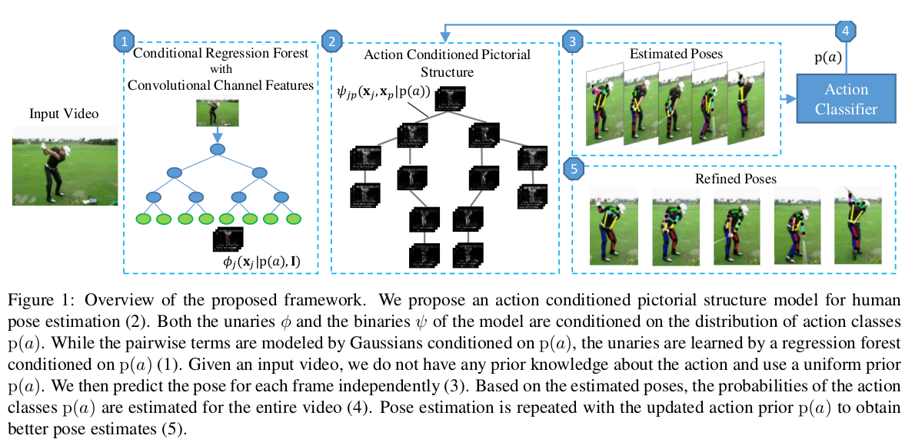

 ## [Pose for Action - Action for Pose](https://arxiv.org/pdf/1603.04037v1.pdf)。

 * 文章是使用 Action Recognition的结果来改善 Pose Estimate，再使用Pose Estimate 的结果来改善Action Recognition的结果。这样一个迭代的优化过程。

### Details
* 文章对人体使用PS模型，P(x|P(a))中先验P(a)表示Action class。
* 初始化P(a)使用默认uniform prior。
* P(x|P(a))中的Unary 使用Random Regression forest(？细节？)，使用CNN特征。Binary项用混合高斯模型。

### 如果打算follow本文章。需要详细看P(x|p(a))各项定义。
### 本文章效果很好。
