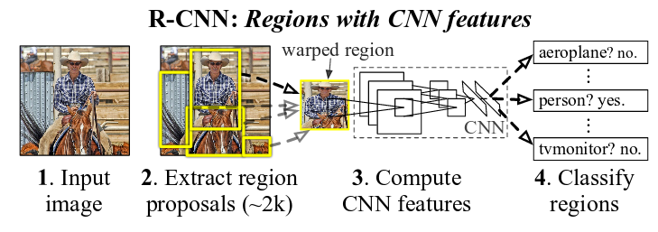
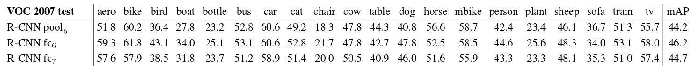
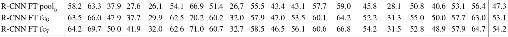
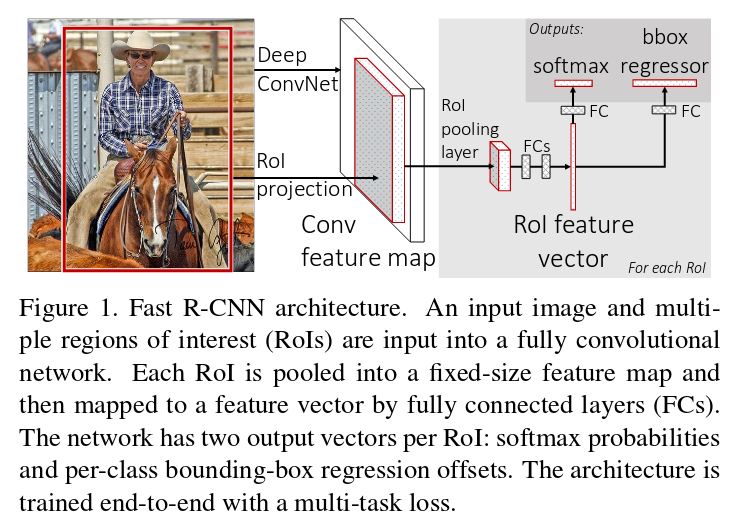

## [RCNN](https://arxiv.org/pdf/1311.2524v5.pdf)

* object proposal using selective search
* feature extraction using CNN. warped proposes into `227*227` pixel size.
* svm classification.

### Training

* supervised pre-training using ILSVRC2012
* adapt classification cnn to detection task by domain-specific finetuning. (使用所有与真值的IoU>= 0.5的proposals作为positive examples)

### Category Classifiers

* 与finetune的参数不一样，这里在训练svm时把IoU>=0.3的看做positive examples.
* hard negative mining. 主要来解决如果负样本太多，如果全部使用来训练，计算代价太大，所以只使用hard negative instances.
(Boostrapping) 先挑选一个负样本的子集来训练分类器，然后将分错的负样本作为hard negative examples, 接着下一轮训练

### Experiments

* pool5, fc6, fc7

这是没有finetune的结果，我们可以看到fc6的结果要比fc7好，而且pool5给出的结果已经很不错。
这说明CNN的表达能力主要体现在convolutional operations.
但是finetune之后，fc6,fc7相比pool5提升很大

### Limitation

R-CNN相对比较慢，因为要对每一个proposal去执行forward pass计算feature, 没有sharing computation.

SPPnets改进了这个问题，对一副图像计算特征，然后对每一个proposal去抽取特征。另外，也可以接受任意大小的图像输入.
它的做法是把pool5替换为spatial pyramid pooling，可以输出一个固定长度的特征向量，然后送到fc layer.

## [Fast RCNN](https://arxiv.org/pdf/1504.08083v2.pdf)

* ROI pooling layer 是一个一层的spp layer. 它将任意大小的一个proposal分成相同个数的网格，然后对每一个grid做max pooling.
这一层替换了最后一个pooling 层。
* multi-tasl loss: (classification and bounding box regression)
* approximate fully connected layer by truncated svd

## [Faster RCNN](https://arxiv.org/pdf/1506.01497v3.pdf)
