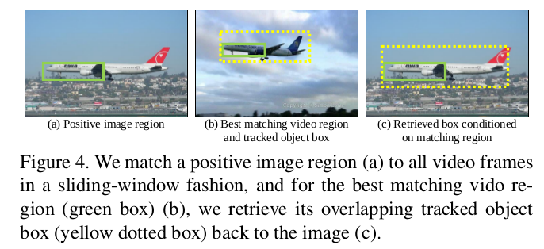

## [Track and Transfer: Watching Videos to Simulate Strong Human Supervision for Weakly-Supervised Object Detection](http://krsingh.cs.ucdavis.edu/krishna_files/papers/track_transfer/track_transfer.html)

TL;DR

* mining discriminative positive regions in the weakly-labeled image collections. 这个判别区域是指在positive examples频繁出现，在negative examples出现较少的区域
* transfer tracked bounding boxes. 就是利用weakly-labelled video上的结果来估计weakly-labelled image上的ground-truth的区域
* 然后用pesudo ground-truth去训练detector

文章的主要思想是利用video信息来解决object detection中需要的大量训练样本的问题.

### Implemental Details

* mining stage. 每个图像生成2000个proposals using SS. 特征用的AlexNet pool5. 然后对每一个proposal, 去每一张图像里找nearest neighor region using cosine similarity (只计算特征的方向的差异，不管大小，适合高维特征空间).
```Matlab
d = f1*f2' / (norm(f1,2) * norm(f2,2))
% 也可以先将特征正则化后，直接乘就好
```
然后每一个region与其k个最近邻构成一个cluster, 这些clusters的排序是根据每个region的k近邻中属于positive images的数量来定义的.
取前几个排序排在前面的clusters的regions作为positive regions.

> 这个方法计算量有点大。感觉可以先去掉一些outliers, 然后再做操作. 比如可以使用random walk去找outliers.

* 作者认为通过上面找出的discriminant regions有很多是object parts, 或者co-occuring background regions, 并不能准确的localize objects.
因此需要improve the localization, 也就是transfer过程：将image regions和video regions进行匹配，使用的conv5特征. 具体思想如下图



> 这个根据discriminant regions的匹配结果transfer boxes的思想其实是认为在视频中，匹配到的part以及其对应的box, 与图像中的应该是相同比例的。
然后找到一些video boxes之后，再使用mean-shift去投票每个box,即density area的boxes的scores会大.


