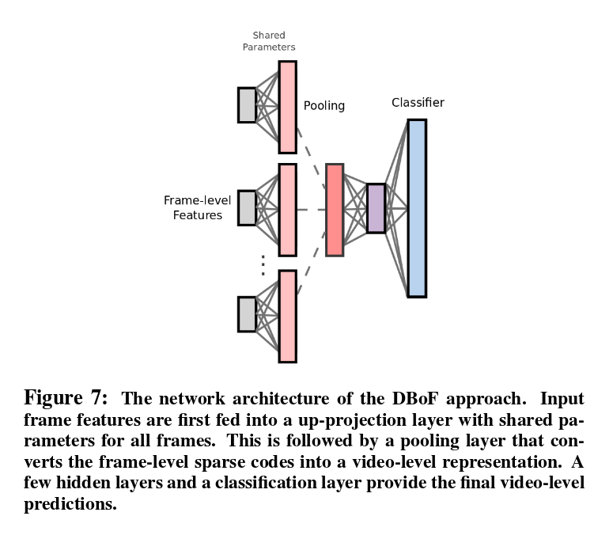
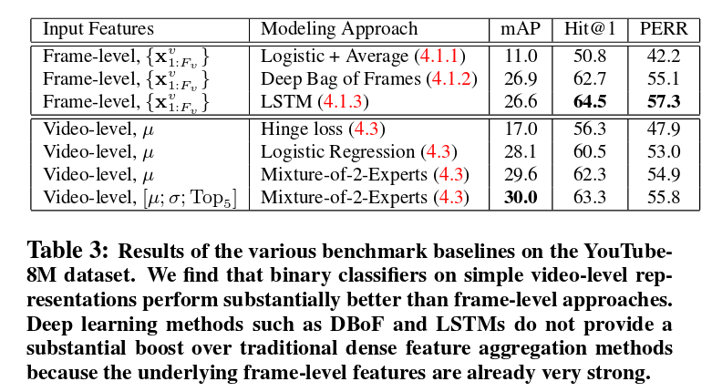

## [YouTube-8M: A Large-Scale Video Classification Benchmark](https://arxiv.org/pdf/1609.08675.pdf) [[Project Page](https://research.google.com/youtube8m/)]

TL;DR

Google Research新发布的video classification benchmark,
包含`8 million` videos, about `500K` hours.
总共包含`4800` classes, `1.8` classes per video.

### Baseline Approaches

着重看一下各个baseline在这个数据集的效果

#### Frame-level Models

就是每一帧去训练分类器.
总共有4800个class, 那就训练了4800个`one-vs all` classifiers.
特征使用的deep features.

最后做分类的几种方式:
1. average pooling, 即使用所有frames的分类平均值作为视频的类别估计.
2. Deep Bag of Features (DBoF) pooling

* 首先将deep features与一个`M` 个units的fully connected layers相连，即将input features投影到一个高维空间。
这层的权重在各个帧中是共享的。加上ReLU activation, 会产生sparse coding (_why_?)
* 然后会经过一个max pooling layer, 得到一个video-level representation, 然后可以送到logistic or softmax layer做分类.

> 个人认为同样是deep features, ICIP2016 Best Paper(semantic segmentation) 认为其维度太高，使用hashing去降维, 而对于这个分类
任务，认为维度太低，需要映射到更高维的空间中去。此外，这里deep features是经过了一个fc layer, fc layer可以使特征进行组合，并且
将特征进行non-linear转换。而为什么ReLU可以导致sparse coding, 看一下其公式: `f(x) = max(0, x)`, 即如果`x < 0`, 那么, ReLU强制其等于`0`,
从而导致了sparsity.

3. LSTM. 

#### Video-level Models

特征是对图像特征做了first, second and ordinal statistics, 然后经过decorrelate和normalization后，
使用LR, SVM, 或mixture of experts做分类.

*by tfzhou*
