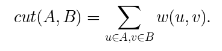
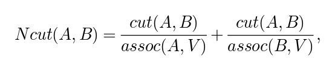

## Normalized Cut

### min-cut

min-cut favors cutting small sets of isolated nodes in the graph.
通过上面公式可以看出，两个集合的连接edges越多，可能导致cut增大

### n-cut

`assoc(A, V)` 指的是从`A`到图中所有其他nodes的连接的权重之和。
这个准则目的是使每个partition内的各个nodes的连接weights相对于多个partitions之间连接的weights要尽可能大。

目前求解最优的n-cut算法是spectral bisection, 它用laplacian matrix的第二小的eigenvalue对应的eigenvector来做partition.

[a summary on n-cut](http://www.cs.ucsb.edu/~veronika/MAE/summary_normalizedcuts_and_imagesegmentation.pdf)

### Fast Downsampled Eigenvector Computation (MCG)

* 如果一个矩阵`A`是bistochastic matrix, 那么其特征向量与矩阵`A^2`的特征向量相同。
* 一个downsampled的`A`的特征向量与`A`的相似。

> bistochastic matrix. 矩阵的每一行每一列加起来都等于1.

